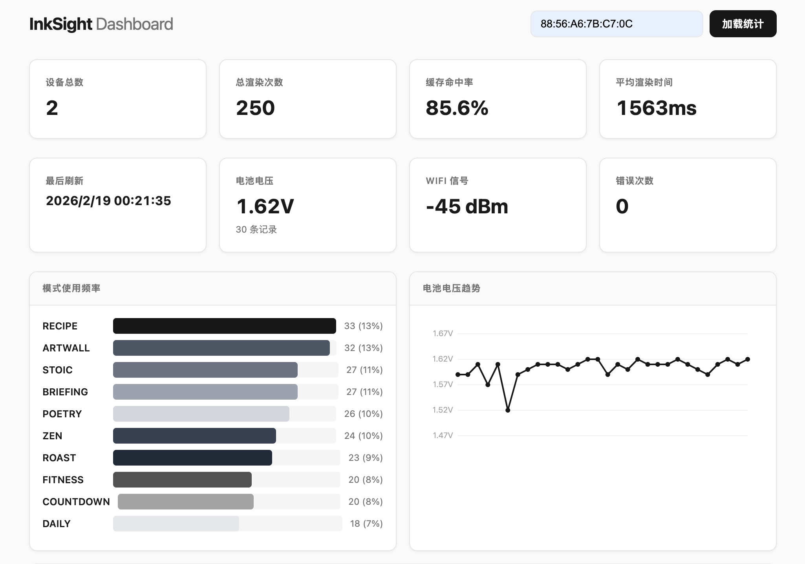

English | [中文](README_ZH.md)

# InkSight | inco (墨鱼)

> An LLM-powered smart e-ink desktop companion that delivers calm, meaningful "slow information" — your personal ink-on-paper intelligence.


---

## Overview

**inco** (墨鱼) is a smart e-ink desktop companion built around InkSight. It uses a backend LLM to generate personalized content based on real-time context — weather, time of day, date, and solar terms — and renders it on a 4.2-inch e-ink screen. With 10 content modes ranging from Stoic philosophy to fitness plans, from tech briefings to daily recipes, inco brings a thoughtful, intelligent companion to your desk.

The backend is built on the OpenAI-compatible SDK, so it works out of the box with **DeepSeek**, **Alibaba Bailian (Qwen)**, and **Moonshot (Kimi)**. Any OpenAI-compatible API provider (OpenAI, Groq, Together AI, etc.) can be used with minimal configuration. Modes are extensible via a JSON config-driven system — create your own content modes without writing Python.

**Key Features:**

- **10+ Content Modes** — Stoic, Roast, Zen, Daily, Briefing, ArtWall, Recipe, Fitness, Poetry, Countdown + custom JSON modes
- **Extensible Mode System** — Define new modes via JSON config (prompt, layout, style) without writing code
- **4 Refresh Strategies** — Random, Sequential, Time-Bound, Smart
- **On-Demand Refresh** — Single press for instant refresh, double press to switch mode, or trigger remotely via web
- **Statistics Dashboard** — Device status monitoring, battery voltage trends, mode usage stats, cache hit rate
- **WiFi Provisioning** — Captive Portal auto-popup for zero-friction setup
- **Web Configuration** — Full settings management with import/export, live preview, and config history
- **Smart Caching** — Batch pre-generated content with sub-second response times
- **Multi-LLM Support** — DeepSeek, Alibaba Bailian, Moonshot, and any OpenAI-compatible API
- **Ultra-Low Power** — Deep Sleep mode, 3-6 months battery life on a single charge

---

## Content Modes


| Mode | Description |
|------|-------------|
| **STOIC** — Stoic Philosophy | Solemn, introspective philosophical quotes, perfect for weekday mornings |
| **ROAST** — Witty Roast | Sharp, humorous roasts that use dark humor to relieve stress |
| **ZEN** — Zen | Minimalist characters (e.g. "静" / stillness, "空" / emptiness), creating a tranquil atmosphere |
| **DAILY** — Daily Picks | Rich layout with quotes, book recommendations, fun facts, and seasonal info |
| **BRIEFING** — AI Briefing | Hacker News Top 3 + Product Hunt #1, with AI industry insights |
| **ARTWALL** — AI Gallery | Black-and-white woodcut-style artwork generated from weather and seasonal context |
| **RECIPE** — Daily Recipe | Seasonal ingredient-based meal plans for breakfast, lunch, and dinner |
| **FITNESS** — Fitness Plan | Simple home workout routines with exercise lists and health tips |
| **POETRY** — Daily Poetry | Curated classical Chinese poetry, celebrating the beauty of language |
| **COUNTDOWN** — Countdown | Countdown / count-up timers for important dates and anniversaries |

---

## Refresh Strategies

| Strategy | Description |
|----------|-------------|
| **Random** | Randomly pick from enabled modes |
| **Sequential** | Cycle through enabled modes in order (progress persists across reboots) |
| **Time-Bound** | Display different modes based on time of day (e.g. Recipe in the morning, Briefing mid-day, Zen at night) |
| **Smart** | Automatically match the best mode to the current time slot |

### Smart Mode Default Schedule

| Time Slot | Recommended Modes |
|-----------|-------------------|
| 06:00 - 09:00 | Recipe, Daily |
| 09:00 - 12:00 | Briefing, Stoic |
| 12:00 - 14:00 | Zen, Poetry |
| 14:00 - 18:00 | Stoic, Roast |
| 18:00 - 21:00 | Fitness, Recipe |
| 21:00 - 06:00 | Zen, Poetry |

---

## Architecture


| Layer | Tech Stack |
|-------|------------|
| Hardware | ESP32-C3 + 4.2" E-Paper (400x300, 1-bit) + LiFePO4 battery |
| Firmware | PlatformIO / Arduino, GxEPD2, WiFiManager |
| Backend | Python FastAPI, Pillow, OpenAI SDK, httpx, SQLite |
| Frontend | HTML / CSS / JavaScript (Config page, Preview console, Stats dashboard) |

For detailed architecture design, see the [Architecture Documentation](docs/architecture.md) (Chinese).

---

## Getting Started

### 1. Hardware

- ESP32-C3 dev board (SuperMini recommended)
- 4.2" e-ink display (SPI, 400x300)
- LiFePO4 battery + TP5000 charge module (optional)

See the [Hardware Guide](docs/hardware.md) (Chinese) for wiring details.

### 2. Backend Deployment

```bash
# Clone the repository
git clone https://github.com/datascale-ai/inksight.git
cd inksight/backend

# Install dependencies
pip install -r requirements.txt

# Download font files (Noto Serif SC, Lora, Inter — ~70MB)
python scripts/setup_fonts.py

# Configure environment variables
cp .env.example .env
# Edit .env and fill in your API key

# Start the server
python -m uvicorn api.index:app --host 0.0.0.0 --port 8080
```

Once running, visit:

| Page | URL | Description |
|------|-----|-------------|
| Preview Console | `http://localhost:8080` | Test rendering for each mode |
| Config Manager | `http://localhost:8080/config` | Manage device configuration |
| Stats Dashboard | `http://localhost:8080/dashboard` | Device status and usage statistics |

### 3. Firmware Flashing

```bash
cd firmware

# Build and upload with PlatformIO
pio run --target upload

# Monitor serial output
pio device monitor
```

Alternatively, open `firmware/src/main.cpp` in Arduino IDE to compile and upload.

### 4. WiFi Provisioning

1. On first boot (or hold BOOT button for 2 seconds) to enter provisioning mode
2. Connect your phone to the `InkSight-XXXXXX` hotspot
3. A configuration page will pop up automatically — select your WiFi and enter the password
4. The device will connect and start working once configuration is complete

### 5. Button Controls

| Action | Effect |
|--------|--------|
| Short press BOOT (< 2s) | Refresh current content immediately |
| Double press BOOT (< 500ms interval) | Switch to next mode and refresh |
| Long press BOOT (>= 2s) | Reboot and enter provisioning mode |

---

## Configuration


Visit `http://your-server:8080/config?mac=XX:XX:XX:XX:XX:XX` to configure your device:

| Setting | Description |
|---------|-------------|
| Nickname | Device display name |
| Content Modes | Select which modes to display (multi-select) |
| Refresh Strategy | Random / Sequential / Time-Bound / Smart |
| Time-Bound Rules | Map time slots to specific modes (up to 12 rules) |
| Refresh Interval | 10 minutes to 24 hours |
| Language | Chinese / English / Bilingual |
| Content Tone | Positive / Neutral / Profound / Humorous |
| Character Voice | Presets (Lu Xun, Wang Xiaobo, Stephen Chow, etc.) + custom (hover to preview style) |
| Location | Used for weather data |
| LLM Provider | DeepSeek / Alibaba Bailian / Moonshot |
| LLM Model | Select a specific model based on provider |
| Countdown Events | Date events for COUNTDOWN mode (up to 10) |

### Config Management

- **Import / Export** — Backup and migrate device config in JSON format
- **Live Preview** — Preview rendering for each mode before saving
- **Remote Refresh** — Trigger the device to refresh content on next wake-up
- **Config History** — View and rollback to previous config versions

See the [API Documentation](docs/api.md) (Chinese) for full endpoint details.

---

## Statistics Dashboard



Visit `http://your-server:8080/dashboard?mac=XX:XX:XX:XX:XX:XX` to view device statistics:

- **Device Status** — Last refresh time, battery voltage, WiFi signal strength (RSSI)
- **Voltage Trend** — Battery voltage history chart (last 30 records)
- **Mode Stats** — Usage frequency distribution per mode
- **Daily Renders** — Daily render count bar chart
- **Cache Hit Rate** — Cache usage efficiency
- **Render Log** — Recent render details (mode, duration, status)

---

## API Endpoints

| Method | Path | Description |
|--------|------|-------------|
| GET | `/api/health` | Health check |
| GET | `/api/render` | Generate BMP image (called by device) |
| GET | `/api/preview` | Generate PNG preview |
| POST | `/api/config` | Save device configuration |
| GET | `/api/config/{mac}` | Get current configuration |
| GET | `/api/config/{mac}/history` | Get configuration history |
| PUT | `/api/config/{mac}/activate/{id}` | Activate a specific configuration |
| POST | `/api/device/{mac}/refresh` | Trigger immediate device refresh |
| GET | `/api/device/{mac}/state` | Get device runtime state |
| GET | `/api/stats/overview` | Global statistics overview |
| GET | `/api/stats/{mac}` | Device statistics detail |
| GET | `/api/stats/{mac}/renders` | Render history (paginated) |

---

## Project Structure

```
inksight/
├── backend/                # Python backend service
│   ├── api/index.py        # FastAPI entry point + all API endpoints
│   ├── core/               # Core modules
│   │   ├── config.py       # Configuration constants
│   │   ├── config_store.py # Config storage + device state (SQLite)
│   │   ├── stats_store.py  # Statistics collection and queries
│   │   ├── context.py      # Environment context (weather/date)
│   │   ├── content.py      # LLM content generation
│   │   ├── json_content.py # JSON mode content generation
│   │   ├── pipeline.py     # Unified generation pipeline
│   │   ├── renderer.py     # Builtin mode image rendering
│   │   ├── json_renderer.py# JSON mode image rendering
│   │   ├── mode_registry.py# Mode registration (builtin + JSON)
│   │   ├── cache.py        # Caching system
│   │   ├── schemas.py      # Pydantic request validation
│   │   ├── patterns/       # Builtin Python mode implementations
│   │   └── modes/          # JSON mode definitions
│   │       ├── schema/     # JSON Schema for mode validation
│   │       ├── builtin/    # Built-in JSON modes (stoic, roast, zen, fitness, poetry)
│   │       └── custom/     # User-defined custom JSON modes
│   ├── scripts/            # Utility scripts
│   │   └── setup_fonts.py  # Font download script
│   ├── fonts/              # Font files (downloaded via script)
│   │   └── icons/          # PNG icons
│   ├── tests/              # Test files
│   ├── requirements.txt    # Python dependencies
│   └── vercel.json         # Vercel deployment config
├── firmware/               # ESP32-C3 firmware
│   ├── src/
│   │   ├── main.cpp        # Main firmware (button handling + refresh logic)
│   │   ├── config.h        # Pin definitions + constants
│   │   ├── network.cpp     # WiFi / HTTP / NTP (with RSSI reporting)
│   │   ├── display.cpp     # E-ink display logic
│   │   ├── storage.cpp     # NVS storage
│   │   └── portal.cpp      # Captive Portal provisioning
│   ├── data/portal_html.h  # Provisioning page HTML
│   └── platformio.ini      # PlatformIO configuration
├── web/                    # Web frontend
│   ├── config.html         # Configuration manager
│   ├── preview.html        # Preview console
│   └── dashboard.html      # Statistics dashboard
└── docs/                   # Documentation
    ├── architecture.md     # System architecture
    ├── api.md              # API reference
    └── hardware.md         # Hardware guide
```

---

## Roadmap

- [x] WiFi provisioning (Captive Portal)
- [x] Online config management + config history
- [x] Sequential / Random refresh strategies
- [x] Time-Bound + Smart refresh strategies
- [x] Smart caching (cycle index persists across reboots)
- [x] 10 content modes (including Poetry and Countdown)
- [x] Multi-LLM provider support
- [x] On-demand refresh (button press / double press + web remote trigger)
- [x] Config import/export + live preview
- [x] Toast notifications replacing confirm/alert dialogs
- [x] Enhanced Preview console (request cancellation, history, rate limiting, resolution simulation)
- [x] Statistics dashboard (device monitoring + usage stats + chart visualization)
- [x] RSSI signal strength reporting
- [x] Extensible mode system (JSON config-driven custom modes)
- [ ] Multi-resolution display support (backend rendering adaptation)
- [ ] User-provided API keys
- [ ] One-click Vercel deployment
- [ ] Hardware productization (PCB design)

---

## Contributing

Issues and Pull Requests are welcome! See the [Contributing Guide](CONTRIBUTING.md) (Chinese) for details.

---

## License

[MIT License](LICENSE)

---

## Acknowledgments

- [Open-Meteo](https://open-meteo.com/) — Free weather data API
- [Hacker News](https://news.ycombinator.com/) — Tech news
- [Product Hunt](https://www.producthunt.com/) — Product discovery
- [DeepSeek](https://www.deepseek.com/) — LLM provider
- [Alibaba Bailian](https://bailian.console.aliyun.com/) — LLM provider (Qwen)
- [Moonshot](https://www.moonshot.cn/) — LLM provider (Kimi)
- [GxEPD2](https://github.com/ZinggJM/GxEPD2) — E-Paper display driver library
