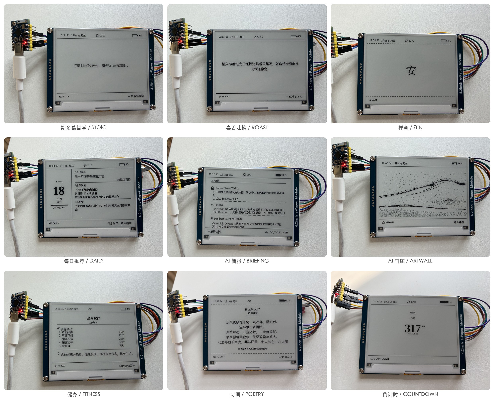
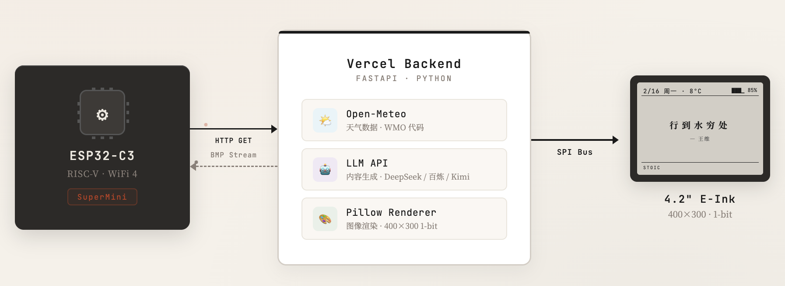

[English](README.md) | 中文

# InkSight (墨见)

> A minimalist smart e-ink desktop companion powered by LLM, delivering calm and meaningful "slow information" to your desk.

> 一款极简主义的智能电子墨水屏桌面摆件，通过 LLM 生成有温度的"慢信息"。


---

## 项目简介

InkSight 通过后端 LLM（DeepSeek / 通义千问 / Kimi）生成基于当前环境（天气、时间、日期、节气）的个性化内容，在 4.2 英寸电子墨水屏上展示。支持 10 种不同的内容模式，从哲学语录到健身计划，从科技简报到每日食谱，为你的桌面带来有温度的智能陪伴。

**核心特点：**

- **10 种内容模式** — 斯多葛哲学、毒舌吐槽、禅意、每日推荐、AI 简报、AI 画廊、食谱、健身、诗词、倒计时
- **4 种刷新策略** — 随机轮换、循环轮换、时段绑定、智能模式
- **按需刷新** — 短按按钮立即刷新，双击切换下一个模式，Web 端远程触发
- **统计仪表板** — 设备状态监控、电池电压趋势、模式使用统计、缓存命中率
- **WiFi 配网** — Captive Portal 自动弹出配置页面，零门槛
- **在线配置** — Web 界面管理所有设置，支持配置导入/导出、预览效果、历史配置
- **智能缓存** — 批量预生成内容，响应时间 < 1 秒
- **多 LLM 支持** — DeepSeek、阿里百炼、月之暗面
- **超低功耗** — Deep Sleep 模式，单次充电续航 3-6 个月

---

## 内容模式



| 模式 | 说明 |
|------|------|
| **STOIC** - 斯多葛哲学 | 庄重、内省的哲学语录，适合工作日的清晨 |
| **ROAST** - 毒舌吐槽 | 犀利的中文吐槽，用黑色幽默缓解压力 |
| **ZEN** - 禅意 | 极简的汉字（如"静"、"空"），营造宁静氛围 |
| **DAILY** - 每日推荐 | 语录、书籍推荐、冷知识、节气信息的丰富排版 |
| **BRIEFING** - AI 简报 | Hacker News Top 3 + Product Hunt #1，AI 行业洞察 |
| **ARTWALL** - AI 画廊 | 根据天气/节气生成黑白版画风格的艺术作品 |
| **RECIPE** - 每日食谱 | 时令食材推荐早中晚三餐方案，荤素搭配 |
| **FITNESS** - 健身计划 | 简单的居家健身训练计划，动作列表 + 健康提示 |
| **POETRY** - 每日诗词 | 精选古典诗词，感受文字之美 |
| **COUNTDOWN** - 倒计时 | 重要日期倒计时/正计日，纪念日提醒 |

---

## 刷新策略

| 策略 | 说明 |
|------|------|
| **随机轮换** | 从已启用的模式中随机选取 |
| **循环轮换** | 按顺序循环切换已启用的模式（重启后不丢失进度） |
| **时段绑定** | 根据时间段显示不同内容模式（如早上食谱、上午简报、晚上禅意） |
| **智能模式** | 根据时间段自动匹配最佳模式（早餐建议 / 科技简报 / 运动计划等） |

### 智能模式默认时段

| 时间段 | 推荐模式 |
|--------|----------|
| 06:00 - 09:00 | 食谱、每日推荐 |
| 09:00 - 12:00 | AI 简报、斯多葛 |
| 12:00 - 14:00 | 禅意、诗词 |
| 14:00 - 18:00 | 斯多葛、毒舌 |
| 18:00 - 21:00 | 健身、食谱 |
| 21:00 - 06:00 | 禅意、诗词 |

---

## 技术架构




| 层 | 技术栈 |
|----|--------|
| 硬件 | ESP32-C3 + 4.2" E-Paper (400x300, 1-bit) + LiFePO4 电池 |
| 固件 | PlatformIO / Arduino, GxEPD2, WiFiManager |
| 后端 | Python FastAPI, Pillow, OpenAI SDK, httpx, SQLite |
| 前端 | HTML / CSS / JavaScript (配置页面 & 预览控制台 & 统计仪表板) |

详细架构设计请参考 [系统架构文档](docs/architecture.md)。

---

## 快速开始

### 1. 硬件准备

- ESP32-C3 开发板 (推荐 SuperMini)
- 4.2 英寸电子墨水屏 (SPI 接口, 400x300)
- LiFePO4 电池 + TP5000 充电模块 (可选)

硬件接线详见 [硬件指南](docs/hardware.md)。

### 2. 后端部署

```bash
# 克隆项目
git clone https://github.com/datascale-ai/inksight.git
cd inksight/backend

# 安装依赖
pip install -r requirements.txt

# 下载字体文件 (Noto Serif SC, Lora, Inter — 约 70MB)
python scripts/setup_fonts.py

# 配置环境变量
cp .env.example .env
# 编辑 .env 文件，填入你的 API Key

# 启动服务
python -m uvicorn api.index:app --host 0.0.0.0 --port 8080
```

启动后访问：

| 页面 | URL | 说明 |
|------|-----|------|
| 预览控制台 | `http://localhost:8080` | 测试各模式渲染效果 |
| 配置管理 | `http://localhost:8080/config` | 管理设备配置 |
| 统计仪表板 | `http://localhost:8080/dashboard` | 设备状态与使用统计 |

### 3. 固件烧录

```bash
cd firmware

# 使用 PlatformIO 编译并上传
pio run --target upload

# 查看串口日志
pio device monitor
```

或使用 Arduino IDE 打开 `firmware/src/main.cpp` 进行编译上传。

### 4. 配网

1. 首次启动或长按 BOOT 按钮 2 秒进入配网模式
2. 手机连接设备热点 `InkSight-XXXXXX`
3. 自动弹出配置页面，选择 WiFi 并输入密码
4. 配置完成后设备自动连接并开始工作

### 5. 按钮操作

| 操作 | 效果 |
|------|------|
| 短按 BOOT (< 2 秒) | 立即刷新当前内容 |
| 双击 BOOT (间隔 < 500ms) | 切换到下一个模式并刷新 |
| 长按 BOOT (>= 2 秒) | 重启并进入配网模式 |

---

## 配置说明

访问 `http://your-server:8080/config?mac=XX:XX:XX:XX:XX:XX` 进行在线配置：

| 配置项 | 说明 |
|--------|------|
| 昵称 | 设备名称 |
| 内容模式 | 选择要显示的模式（可多选） |
| 刷新策略 | 随机轮换 / 循环轮换 / 时段绑定 / 智能模式 |
| 时段规则 | 时段绑定模式下配置不同时段对应的模式（最多 12 条） |
| 刷新间隔 | 10 分钟 ~ 24 小时 |
| 语言偏好 | 中文 / 英文 / 中英混合 |
| 内容调性 | 积极 / 中性 / 深沉 / 幽默 |
| 角色语气 | 鲁迅、王小波、周星驰等预设 + 自定义（悬停查看风格简介） |
| 地理位置 | 用于获取天气信息 |
| LLM 提供商 | DeepSeek / 阿里百炼 / 月之暗面 |
| LLM 模型 | 根据提供商选择具体模型 |
| 倒计时事件 | COUNTDOWN 模式使用的日期事件（最多 10 个） |

### 配置管理功能

- **配置导入/导出** — JSON 格式备份和迁移设备配置
- **配置预览** — 保存前可预览各模式的渲染效果
- **立即刷新** — 远程触发设备在下次唤醒时刷新内容
- **历史配置** — 查看、回滚历史配置版本

API 接口详见 [API 文档](docs/api.md)。

---

## 统计仪表板

访问 `http://your-server:8080/dashboard?mac=XX:XX:XX:XX:XX:XX` 查看设备统计：

- **设备状态** — 最后刷新时间、电池电压、WiFi 信号强度
- **电压趋势** — 电池电压历史曲线（最近 30 条记录）
- **模式统计** — 各模式使用频率分布
- **每日渲染** — 每日渲染次数柱状图
- **缓存命中率** — 缓存使用效率
- **渲染记录** — 最近渲染详情（模式、耗时、状态）

---

## API 端点

| 方法 | 路径 | 说明 |
|------|------|------|
| GET | `/api/health` | 健康检查 |
| GET | `/api/render` | 生成 BMP 图像（设备端调用） |
| GET | `/api/preview` | 生成 PNG 预览图 |
| POST | `/api/config` | 保存设备配置 |
| GET | `/api/config/{mac}` | 获取当前配置 |
| GET | `/api/config/{mac}/history` | 获取历史配置 |
| PUT | `/api/config/{mac}/activate/{id}` | 激活指定配置 |
| POST | `/api/device/{mac}/refresh` | 触发设备立即刷新 |
| GET | `/api/device/{mac}/state` | 获取设备运行状态 |
| GET | `/api/stats/overview` | 全局统计概览 |
| GET | `/api/stats/{mac}` | 设备统计详情 |
| GET | `/api/stats/{mac}/renders` | 渲染历史记录（分页） |

---

## 项目结构

```
inksight/
├── backend/                # Python 后端服务
│   ├── api/index.py        # FastAPI 入口 + 所有 API 端点
│   ├── core/               # 核心模块
│   │   ├── config.py       # 配置常量
│   │   ├── config_store.py # 配置存储 + 设备状态 (SQLite)
│   │   ├── stats_store.py  # 统计数据采集与查询
│   │   ├── context.py      # 环境上下文 (天气/日期)
│   │   ├── content.py      # LLM 内容生成
│   │   ├── pipeline.py     # 统一生成管线
│   │   ├── renderer.py     # 图像渲染
│   │   ├── cache.py        # 缓存系统
│   │   ├── schemas.py      # Pydantic 请求校验
│   │   └── patterns/       # 10 种内容模式实现
│   ├── scripts/            # 工具脚本
│   │   └── setup_fonts.py  # 字体下载脚本
│   ├── fonts/              # 字体文件 (需通过脚本下载)
│   │   └── icons/          # PNG 图标
│   ├── tests/              # 测试文件
│   ├── requirements.txt    # Python 依赖
│   └── vercel.json         # Vercel 部署配置
├── firmware/               # ESP32-C3 固件
│   ├── src/
│   │   ├── main.cpp        # 固件主程序（按钮控制 + 刷新逻辑）
│   │   ├── config.h        # 引脚定义 + 常量配置
│   │   ├── network.cpp     # WiFi / HTTP / NTP（含 RSSI 上报）
│   │   ├── display.cpp     # 墨水屏显示逻辑
│   │   ├── storage.cpp     # NVS 存储
│   │   └── portal.cpp      # Captive Portal 配网
│   ├── data/portal.h       # 配网页面 HTML
│   └── platformio.ini      # PlatformIO 配置
├── web/                    # Web 前端
│   ├── config.html         # 配置管理页面
│   ├── preview.html        # 预览控制台
│   └── dashboard.html      # 统计仪表板
└── docs/                   # 项目文档
    ├── architecture.md     # 系统架构
    ├── api.md              # API 接口文档
    └── hardware.md         # 硬件指南
```

---

## 开发路线

- [x] WiFi 配网系统 (Captive Portal)
- [x] 在线配置管理 + 历史配置
- [x] 循环/随机刷新策略
- [x] 时段绑定 + 智能模式刷新策略
- [x] 智能缓存系统（重启后 cycle_index 不丢失）
- [x] 10 种内容模式（含诗词和倒计时）
- [x] 多 LLM 提供商支持
- [x] 按需刷新（短按/双击按钮 + Web 远程触发）
- [x] 配置导入/导出 + 预览效果
- [x] Toast 通知替代 confirm/alert
- [x] Preview 控制台增强（请求取消、历史记录、限速、分辨率模拟）
- [x] 统计仪表板（设备监控 + 使用统计 + 图表可视化）
- [x] RSSI 信号强度上报
- [ ] 支持不同屏幕分辨率（后端渲染适配）
- [ ] 模式可扩展化系统 (JSON 配置驱动)
- [ ] 用户自定义 API Key
- [ ] Vercel 一键部署
- [ ] 硬件产品化 (PCB 设计)

---

## 贡献

欢迎提交 Issue 和 Pull Request！请查看 [贡献指南](CONTRIBUTING.md) 了解详情。

---

## 许可证

[MIT License](LICENSE)

---

## 致谢

- [Open-Meteo](https://open-meteo.com/) — 免费天气数据 API
- [Hacker News](https://news.ycombinator.com/) — 科技资讯
- [Product Hunt](https://www.producthunt.com/) — 产品发现
- [DeepSeek](https://www.deepseek.com/) — LLM 服务
- [阿里百炼](https://bailian.console.aliyun.com/) — LLM 服务
- [月之暗面](https://www.moonshot.cn/) — LLM 服务
- [GxEPD2](https://github.com/ZinggJM/GxEPD2) — E-Paper 显示驱动库
