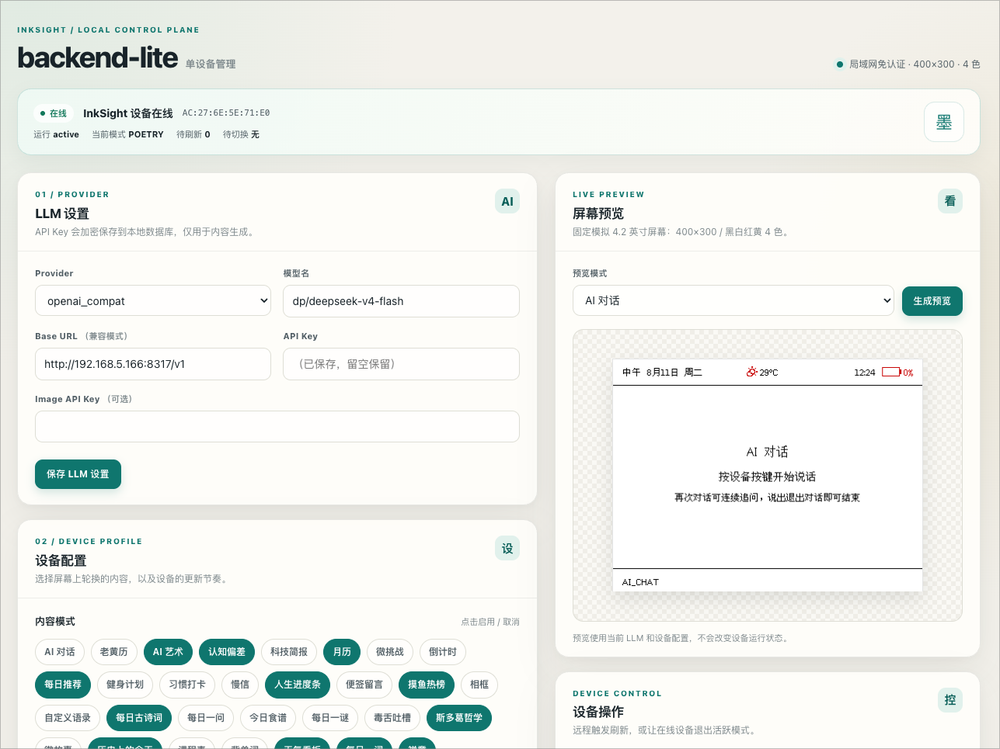
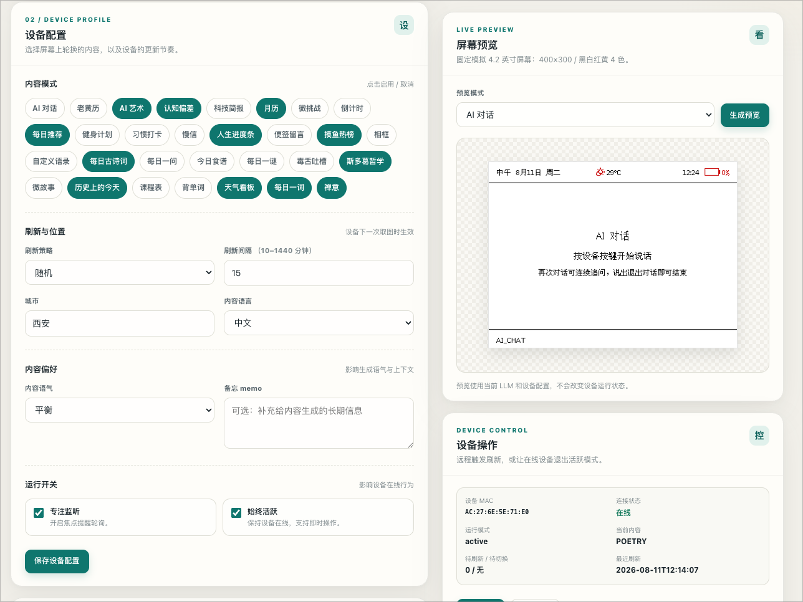
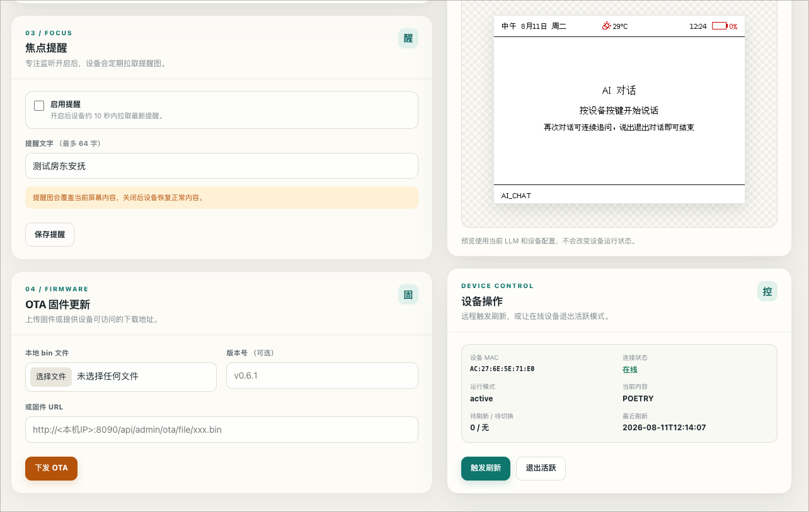

# InkSight backend-lite

InkSight 的轻量单用户后端。直接复用上游 `backend/core/` 渲染内核（保持上游可同步），
自己只维护薄路由 + 单用户 store + 单页管理页。100% 兼容现有固件协议。

## 特性

- 单用户、单设备，无账户/共享/配额/analytics 等多用户平台重量。
- 兼容固件核心链路：render / token / heartbeat / config / state / runtime / refresh。
- 支持焦点提醒 alert-bmp、始终活跃 always_active、专注监听 focus_listening。
- 支持 OTA 固件更新（后端下发 ota_url + 固件 state 解析器补丁）。
- 管理页：单静态 HTML，配置自己的 LLM API key（加密存 DB）、选模式、预览、远程刷新。
- 复用上游全部 30 个内置模式；自定义模式直接放 `backend/core/modes/custom/` 即可。
- 渲染固定 400×300 / 2bpp / 4 色（黑白红黄）。

不支持（固件遇非 200 自动降级）：vocab 词汇复习、voice 语音对话、mode marketplace、自定义模式编辑器 UI。

## 管理页截图

### 管理页总览



### 设备配置与预览



### 焦点提醒、OTA 与设备控制



## 与上游的关系

```
backend/core/        ← 上游原样，git pull 即同步渲染/模式/LLM 逻辑
backend-lite/        ← 本目录，只依赖 core/ 的公开 API
  api/               薄路由（固件端点 + 管理端点）
  adaptee/           渲染适配 + 上游 DB 路径重定向
  store/             单用户 SQLite（lite.db）
  static/            单页管理 UI
```

`backend-lite/adaptee/db_redirect.py` 在启动时把上游 `core/` 的 `inksight.db`/`cache.db`
路径重定向到本目录，避免污染上游 `backend/`，并调上游 `init_stats_db()`/`init_db()`
建 `content_history` 等表（LLM 去重提示需要）。

## 安装

```bash
cd backend-lite
python3 -m venv .venv
. .venv/bin/activate
pip install -r requirements.txt
# 上游 core/ 运行时依赖（zhdate/dashscope/tenacity 等）
pip install -r ../backend/requirements.txt

# 字体（渲染需要，~70MB，首次必做）
python ../backend/scripts/setup_fonts.py

# 配置环境
cp .env.example .env
# 生成加密密钥填入 LLM_ENCRYPTION_KEY：
python -c "from cryptography.fernet import Fernet; print(Fernet.generate_key().decode())"
```

## 运行

推荐使用本目录自带启动入口，它会读取 `.env` 中的 `LITE_HOST` / `LITE_PORT`：

```bash
. .venv/bin/activate
python run.py
```

默认监听 `0.0.0.0:8090`；如果你修改了 `.env`，例如：

```env
LITE_HOST=0.0.0.0
LITE_PORT=21568
```

那么重新运行 `python run.py` 后就会监听在对应地址。

> 如果你直接运行 `uvicorn api.index:app --host ... --port ...`，命令行参数会覆盖 `.env`，这也是之前看起来“改了 `.env` 不生效”的原因。

管理页：浏览器打开 `http://<本机IP>:<LITE_PORT>/`（局域网免认证）。

## 配置流程

1. 管理页「LLM API Key」填 provider + key（deepseek/aliyun/moonshot/openai_compat），保存。
2. 「设备配置」选模式、设刷新策略/间隔/城市，保存。
3. 固件 captive portal 里把后端地址填成 `http://<本机IP>:8090`。
4. 设备开机即取图。开「始终活跃」可远程触发刷新 / 切模式。

## 固件 OTA（可选）

本目录附带固件补丁（`firmware/src/network.cpp` + `main.cpp`）：
- `network.cpp` 的 `/state` 解析器新增提取 `ota_url`/`ota_version` 赋给 `g_pending_ota_*`。
- `main.cpp` 主循环新增 `checkAndPerformOTA()` 调用（上游机器已实现，原本缺触发）。

需用 PlatformIO 重新编译刷写固件：

```bash
cd firmware
pio run --target upload
```

之后管理页「OTA」上传 bin → 设备下次轮询 `/state` 自动下载刷写 → `/ota/progress` 上报进度。

## 端点速查

固件（设备调用）：
- `POST /api/device/{mac}/token` · `POST /api/device/{mac}/heartbeat`
- `GET /api/render` · `GET /api/config/{mac}` · `GET /api/device/{mac}/state`
- `POST /api/config` · `POST /api/device/{mac}/runtime` · `POST /api/device/{mac}/refresh`
- `GET /api/device/{mac}/alert-bmp` · `POST /api/device/{mac}/ota/progress`
- `POST /api/device/{mac}/claim-token`

管理页：
- `GET/PUT /api/admin/config` · `GET /api/admin/modes` · `GET/PUT /api/admin/llm-key`
- `GET /api/admin/state` · `POST /api/admin/refresh` · `POST /api/admin/set-mode` · `POST /api/admin/runtime`
- `GET/PUT /api/admin/alert` · `POST /api/admin/ota/upload` · `POST /api/admin/ota/set` · `GET /api/admin/ota/file/{name}`
- `GET /api/preview?mode=&as_png=1`

## 数据库

- `lite.db` — backend-lite 自有：config / device_state / llm_key / heartbeats / alert_state。
- `inksight.db` — 上游 core 运行时表（content_history 去重等），重定向到本目录。
- `cache.db` — 上游渲染缓存（重定向到本目录）。
